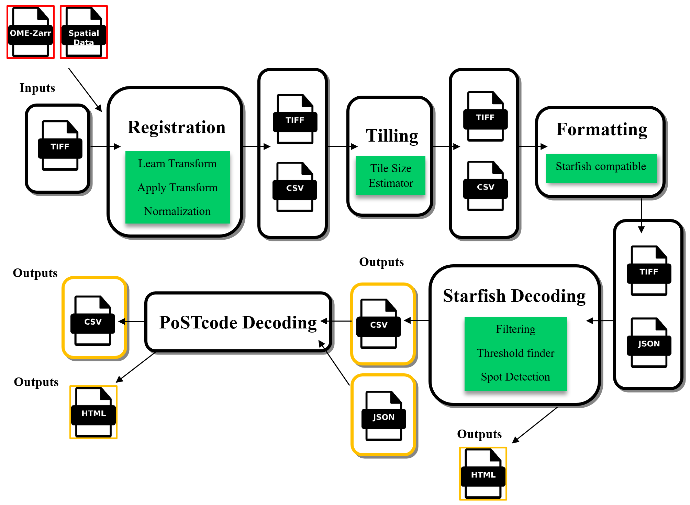

# Reusable in-situ sequencing analysis workflow orchestrated by Nextflow

Nextflow workflow for the automated creation of a transcript map from ISS image data.

| Producer | Microscope | Stitched | Data location | Data public | Execution | Next steps | Issues |
|----------|----------|----------|----------|----------|----------|----------|----------|
| Dima, GSK              | VS200   | Yes   | GSK cluster            | No | Working  |                                            |  PostCODE | 
| Alvaro, EMBL-Rome      | ?       | Yes   | iss-nf-data/alvaro_000 | No | TODO     | [OME-Zarr Conversion](https://git.embl.de/grp-cba/iss-nf/-/issues/3), OME-Zarr Registration |           | 
| Jorge, Saka, EMBL-HD   | ?       | Yes   | ?                      | No | TODO     | [Find the data](https://git.embl.de/grp-cba/iss-nf/-/issues/2)                              |           | 
| PostCODE example       | ?       | No    | iss-nf-data/S-BSST700 | Yes | TODO     | Read access to data, [Stitch it](https://git.embl.de/grp-cba/iss-nf/-/issues/7)                   |           | 
| Muza, EMBL             | Nikon Ti2    | Yes  | embl cluster          | No | TODO     |                                            

## TODO

 - [ ] Scripts for testing data (minimal from StarFISH and mouse-brain tissue: https://zenodo.org/records/7647746)
 - [ ] Docker/Singularity images
 - [ ] Find better way to define input parameters
 - [ ] PostCODE decoding
 - [ ] (Optional) Spot assignment to cells
