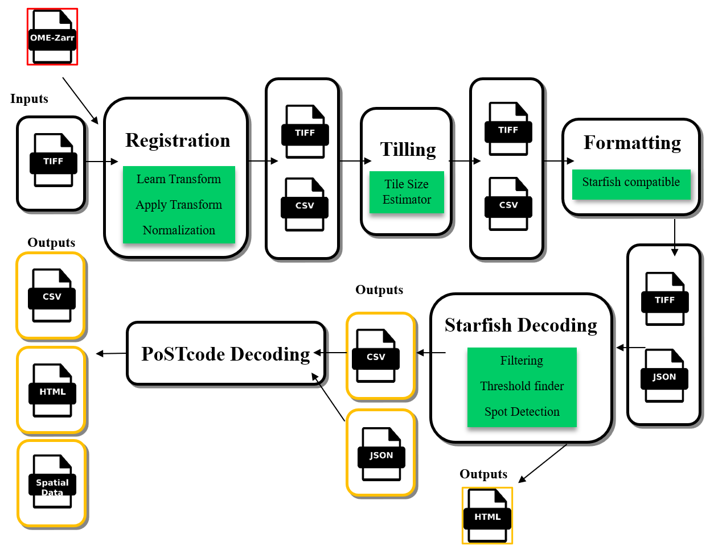

# Reusable in-situ sequencing analysis workflow orchestrated by Nextflow

Nextflow workflow for the automated creation of a transcript map from ISS image data.



# Installation instructions for Your Repository

Follow these steps to set up and install the necessary environment and dependencies for your project.

## Prerequisites

Ensure you have the following installed on your system:
- [Git](https://git-scm.com/) (for cloning the repository)

## Clone the Repository

Clone the project repository from GitHub to your machine.
	
```bash
git clone https://github.com/embl-cba/iss-nf.git
```

## How to run the code

This section will guide you on how to run the workflow using the mouse brain dataset as an example. You can refer to the [mouse brain dataset](https://www.ebi.ac.uk/biostudies/bioimages/studies/S-BSST700) for more context. The stitched and registered images can be located within our EMBL cluster under this address: `/g/cba/exchange/iss-nf-data/mouse-brain/`.

### Steps to run the workflow:

1. **Prepare Your Dataset**

   Before running the workflow, ensure that your data is prepared and follows our naming scheme for images. This ensures the workflow can locate and process your files correctly. The naming scheme is structured as: " r#Round_ChannelName.tiff "  where `r#` corresponds to the round number followd by channel name. 

2. **Modify the configuration files**

   - **Update the Input Directory:**
     In the `nextflow.config` file, locate the `INPUTDIR` variable and set it to the path of your dataset.
     ```bash
     INPUTDIR = "/path/to/your/dataset"
     ```
   
   - **Prepare the codebook:**
     The workflow uses a `codebook.json` file that should be readable by the STARFISH library. Use our default format as a guide when preparing your own codebook.
     
     **Important note:** For automated threshold finding, the algorithm expects 10-20% of your gene panel to consist of empty barcodes. These empty barcodes should be added at the bottom of your `codebook.json`.

   - **Modify the metadata:**
     You’ll also need to update the `experiment_metadata.json` file. This file contains metadata about your dataset. Modify it to reflect the specifics of your data (e.g., number of rounds, channels, etc.).

3. **Load nextflow**

   To run the workflow, you need the Nextflow module. If you are using the EMBL cluster, you can easily load it by running the following command:
   ```bash
   module load Nextflow

4. **Run the workflow**

	Once you’ve updated your configuration files and loaded Nextflow, you can execute the workflow using the following command in your terminal:
	```bash
	nextflow run nf_workflow.nf -profile apptainer 
